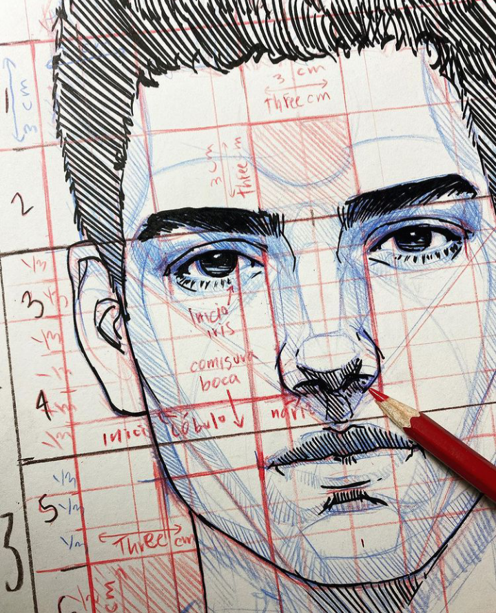

  

# Extration from:
## Digging Into The Display Property: The Two Values Of Display - Rachel Andrew

Flexbox and CSS Grid Layout methods are essentially values of the CSS display property, a workhorse of a property that doesn’t get a lot of attention.
A flex or grid layout starts out with you declaring display: flex or display: grid. These layout methods are values of the CSS display property. However, there are some interesting things to understand about display and how it is defined that will make your life much easier as you use CSS for layout. While it may seem unusual at first for those of us who have been doing CSS for many years, I think these changes really help to explain what is going on when we change the value of display on an element.

# Block And Inline Elements

Some elements on the page are display: block and they have certain features because of this. They stretch out in the inline direction, taking up as much space as is available to them. They break onto a new line; we can give them width, height, margin as well as padding, and these properties will push other elements on the page away from them. some elements are display: inline. Inline elements are like words in a sentence; they don’t break onto a new line, but instead reserve a character of white space between them. If you add margins and padding, this will display but it won’t push other elements away. 

The behavior of block and inline elements is fundamental to CSS and the fact that a properly marked up HTML document will be readable by default. This layout is referred to as “Block and Inline Layout” or “Normal Flow” because this is the way that elements lay themselves out if we don’t do anything else to them.

# Main Text
As Rachel Andrew has reminded us, everything in web design is a box , or the absence of a box. Not everything necessarily looks like a box—border-radius, clip-path, and transforms can be deceptive, but everything takes up a box-like space. Layout is inevitably, therefore, the arrangement of boxes.
Before one can embark on combining boxes to make composite layouts, it is important to be familiar with how boxes themselves are designed to behave as standard.

# The box model
The box model is the formula upon which layout boxes are based, and comprises content, padding, border, and margin. CSS lets us alter these values to change the overall size and shape of elements’ display.